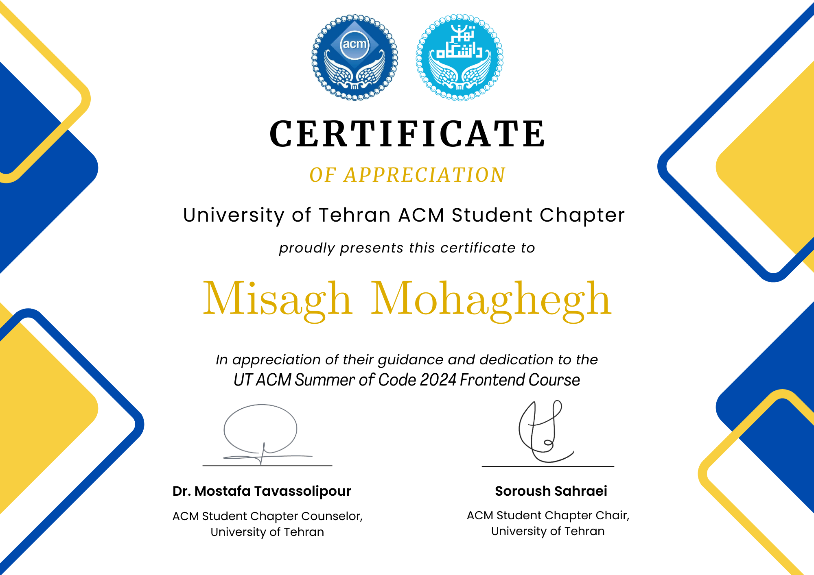

# Frontend Course ACM

This is the main repository of the ACM Summer-of-Code **frontend** course.  
Summer-of-Code is a program that is held by the [ACM](https://ut-acm.ir) student branch of the University of Tehran.  
This course is designed to teach the basics of web development and frontend technologies to students.

The course is taught over a total of **12 two-hour sessions** and includes **6 assignments** to further increase the students' understanding of the topics and technologies.

## Materials

All lecture slides and codes are available in the `Lessons` folder.  
The course assignment descriptions and their sample answers are available in the `Assignments` folder.

## Topics

### 1 - The Basics

- Introduction to the course and its prerequisites
- Course schedule and structure
- Overview of the web building blocks
- The basics of the HTTP protocol
- HTTP requests and responses

### 2 - HTML

- Introduction to HTML
- Elements and attributes
- Anatomy of an HTML document
- Metadata
- Semantic tags
- Forms and inputs

### 3 - CSS (Part 1)

- Introduction to CSS
- Selectors
- Colors
- Text formatting
- Box model

### 4 - CSS (Part 2)

- Fonts
- Units
- Pseudo selectors
- Specificity
- Reset & normalize
- Images

### 5 - CSS (Part 3)

- Positioning
- Flexbox
- Variables
- Transform & transition

### 6 - RWD & Bootstrap

- Responsive web design
- Media queries
- Breakpoints, containers, and grid
- Bootstrap classes

### 7 - JS (Part 1)

- Introduction to JavaScript
- Variables and values
- Operators
- Functions
- Control flow
- DOM manipulation

### 8 - JS (Part 2)

- Strings
- Numbers
- Arrays
- Code examples

### 9 - JS (Part 3)

- Local storage
- Objects
- Prototype
- Class
- Strict mode

### 10 - React (Part 1)

- Modules
- Bundling
- Introduction to React
- JSX & Components
- Loops & conditionals
- Installation and setup

### 11 - React (Part 2)

- Hooks
- State
- Context
- Effect

### 12 - API

- Introduction to APIs
- JSON
- AJAX
- Fetch API

## Assignments

### 1 - HTML

There are 3 questions in this assignment and students are required to create an HTML document for each one.  
The questions include creating a simple CV page, doing certain tasks related to metadata, links, tables, and creating a survey form.
  
### 2 - CSS

3 web page designs are provided in this assignment and students are required to implement them as closely as possible using CSS.  
The designs require the students to think about a clean coding approach and use various CSS properties and selectors.

### 3 - Bootstrap

In this assignment, students implement a fully responsive page design using Bootstrap.

### 4 - JS

This assignment includes 3 questions that require students to write JavaScript code to solve them.  
The questions include creating a page for color testing, a page with light and dark mode support, and a page for submitting student GPAs and ranking them.

### 5 - React

Students will implement a restaurant table reservation website that has a home, customer, and restaurant page.  
This assignment puts the students' accumulated knowledge of HTML, CSS, JS, and React to the test and serves as a final project for the course.

### 6 - API

The table reservation website from the previous assignment will be updated to use a real API and connect to the backend.  
Students will learn how to fetch data from an API, send data to the server, and update the website accordingly.

## Certificate

